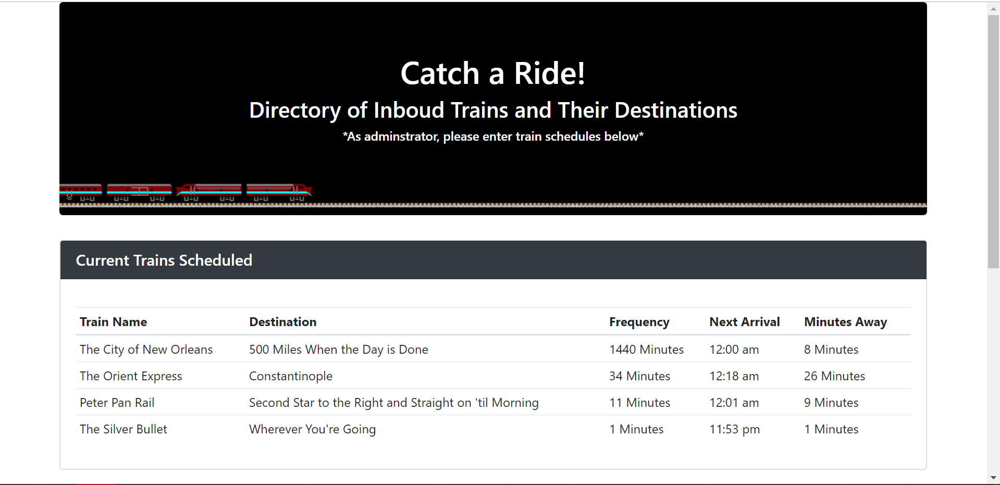
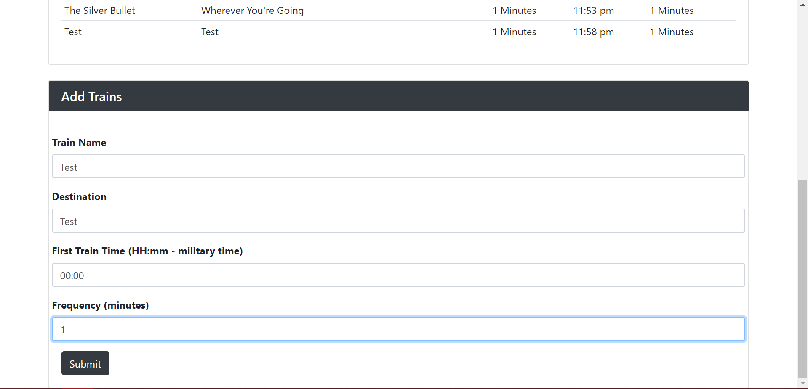

# Train_Timer
I've created a train schedule application that incorporates Firebase to host arrival and departure data. This app retrieves and manipulates this information with Moment.js. This app also provides up-to-date information about various trains, namely their arrival times and how many minutes remain until they arrive at their station.

When adding trains, administrators are able to submit the following:
    
    * Train Name
    
    * Destination 
    
    * First Train Time -- in military time
    
    * Frequency -- in minutes
  
  * The app then calculates when the next train will arrive; relative to the current time.
  
  * Since the app utilized Firebase, users from many different machines are able to view the same train times.

Try out the app [HERE!](https://bdelong.github.io/Train_Timer/)